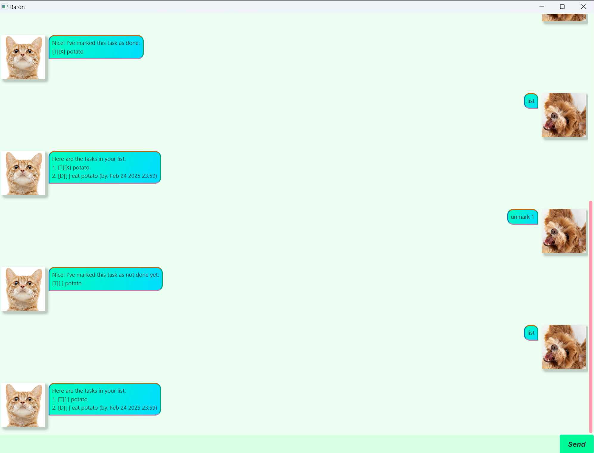

# Baron User Guide



Baron is a ~~scuffed~~ chatbot designed for users to manage tasks efficiently.

## Table of Contents

1. Getting Started
2. Commands
   - Adding Tasks
   - Marking / Unmarking Tasks
   - Deleting Tasks
   - Listing Tasks
   - Finding Tasks
   - Exiting the Application

## Getting Started

1. Download the latest version of [baron.jar](https://github.com/lilyium/ip/releases)
2. Run the application from the terminal by executing the following command:
```
java -jar baron.jar
```

## Commands

### Adding Tasks

Baron provides support for 3 types of tasks, **todo**, **deadline** and **event**.

#### todo

A todo task contains only a task description

Syntax:
```
todo [task description]
```
or 
```
t [task description]
```

Example:
```
todo buy potatoes
```

#### deadline

A deadline task contains both a task description and a deadline

Syntax:
```
deadline [task description] /by [deadline]
```
or
```
d [task description] /by [deadline]
```

Example:
```
deadline buy potatoes /by 21/02/2025
```

#### event

An event task contains a task description, start time and end time

Syntax:
```
event [task description] /from [start time] /to [end time]
```
or
```
e [task description] /from [start time] /to [end time]
```

Example:
```
event buy potatoes /from 21/02/2025 12:00 /to 21/02/2025 14:00
```

#### Supported Date Formats

The following are the supported date formats: dd-mm-yyyy, yyyy-mm-dd, dd/mm/yyyy, yyyy/mm/dd, d MMM yyyy, MMM d yyyy

Optionally, a specific time can be specified by appending it in the following formats: HHmm, HH:mm

In the case where the year, or the hour and minutes are not specified, Baron defaults to the current year, and 23:59 for the time.

### Marking / Unmarking Tasks

Tasks can either be marked as done or unmarked. When creating a task, it is set to not yet done by default.

#### mark

A task can be marked.

Syntax:
```
mark [task number]
```
or
```
m [task number]
```

Example:
```
mark 1
```

#### unmark

A task can be unmarked.

Syntax:
```
unmark [task number]
```
or
```
um [task number]
```

Example:
```
unmark 1
```

### Listing Tasks

It is possible to delete tasks.

Syntax:
```
delete [task number]
```
or
```
del [task number]
```

Example:
```
del 1
```

### Listing Tasks

To list all tasks, type
```
list
```
or
```
l
```

### Finding Tasks

It is possible to find all tasks that match a search term

Syntax:
```
find [search term]
```
or
```
f [search term]
```

Example:
```
find potatoes
```

### Exiting the Application

To exit the application, either click the 'x' in the top right corner or type
```
bye
```